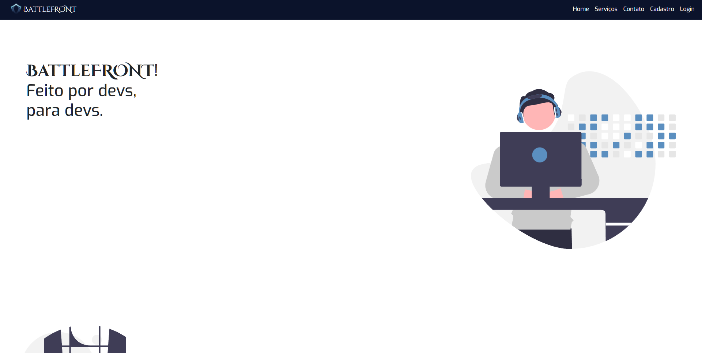

# Projeto final do módulo 2: Lançamento de produto - BattleFRONT

  <a href="#sobre">Sobre</a>&nbsp;&nbsp;&nbsp;
  <a href="#andamento">Andamento</a>&nbsp;&nbsp;&nbsp;
  <a href="#linguagens">Softwares & Ferramentas utilizadas</a>&nbsp;&nbsp;&nbsp;
  <a href="#habilidades">Habilidades adquiridas</a>&nbsp;&nbsp;&nbsp;
  <a href="#grupo">Autores</a> 

<h2 id="sobre">Sobre</h2>
  
Projeto onde precisamos desenvolver o front-end para apresentar um novo produto lançado pela empresa "FrontEnders", onde poderíamos inventar o produto que quiséssemos, pensando em algo que seria legal para ajudar no dia a dia com programação ou estudos.
  Nosso projeto também precisaria estar de acordo com os seguintes requisitos:

  - Possuir home, página de detalhes sobre o serviço, cadastro na lista de espera, contato, log in e recuperação de senha;
  - O framework CSS Boostrap deve ser utilizado na elaboração do projeto (versão 4 ou superior);
  - A API ViaCEP deve ser utilizada para obter dados referentes aos CEPs utilizados no cadastro;
  - Utilizar repositório público no github, com todos os integrantes do grupo como colaboradoradores e disponibilização de uma GithubPage com o projeto;

 

<h2 id="andamento">Andamento do projeto</h2>

  

<h2 id="linguagens">Softwares & Ferramentas utilizadas nesse projeto</h2>

  - [x] HTML5
  - [x] CSS3
  - [x] Bootstrap
  - [x] JavaScript
  - [x] JQuery
  - [x] API - ViaCEP
  - [x] Hoppscotch (para visualização do JSON)
  - [x] Git
  - [x] Kanban

<h2 id="habilidades">Habilidades Adquiridas</h2>

  - Indentação do código
  - Tags semânticas (HTML)
  - Atributos (HTML)
  - Seletores e Combinadores (CSS)
  - Pseudo-classes (CSS)
  - FlexBox (CSS)
  - Responsividade (CSS)
  - Utilização de Bootstrap
  - Function (JS)
  - Condicionais IF, Else (JS)
  - Programação Orientada a Objetos (POO)
  - JQuery (JS)
  - Ajax (JQuery)
  - JSON
  - Uso da API ViaCEP
  - Utilização de metodologias ágeis (Kanban)

<h2 id="grupo">Autores</h2>

  - [Christopher Mamed](https://www.linkedin.com/in/christopher-mamed-407485139/)
  - [Hadassa Moraes](https://www.linkedin.com/in/hadassa-moraes-5a6712230/)
  - [Vitor Del' Duca](https://www.linkedin.com/in/vitor-del-duca-gestao-programacao-treinamento/)
  - [Ytallo Bruno](https://https://linkedin.com/in/ytallobruno)

<h2 id="grupo">Página do Projeto</h2>

 - [Projeto](https://hadmoraes.github.io/BattleFRONT/)

  &#129145;&nbsp;<a href="#inicio"><strong>Voltar ao topo</strong></a>&nbsp;&#129145;

